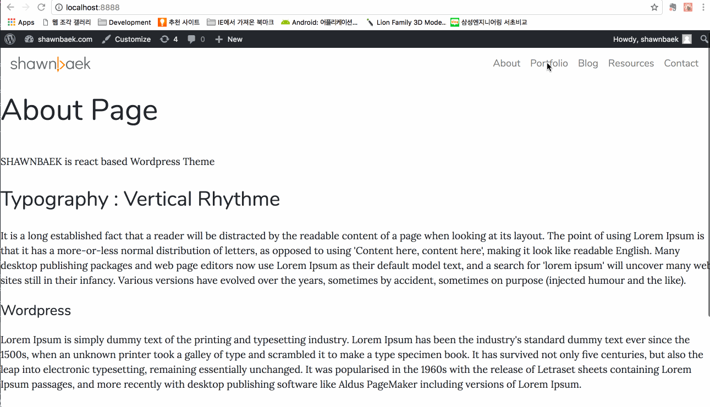
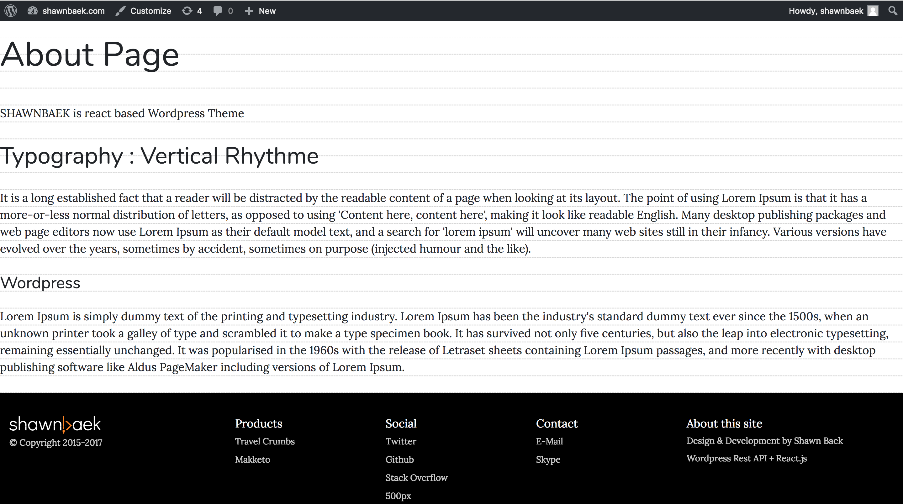

# shawnbaek-WPTheme
React based Wordpress Theme Starter




Save your time. This project is aiming for development Wordpress theme who are not familiar with PHP languages. I set up most popular front-end libraries like a Bootstrap, Lodash, Webpack, React, SASS and More!


## Focus on Design: Typography Vertical Rhythm 


I set up vertical rhythm using gridlover's rule using SASS.

https://www.gridlover.net/


## Libraries

* webpack 
* react.js
* react router v4
* react router dom
* bootstrap v4 beta2
* Advanced Custom Field
* wordpress rest api
* advanced custom field (Wordpress Plugin)

### Wordpress Setup

* [Wordpress Official Install Guide](https://codex.wordpress.org/Installing_WordPress_Locally_on_Your_Mac_With_MAMP)
* [Wordpress Theme Development Guide](https://codex.wordpress.org/Theme_Development)
* [Wordpress REST API](https://developer.wordpress.org/rest-api/)
* [Advanced Custom Fields](https://www.advancedcustomfields.com/)
* [Advanced Custom Fields to REST API](https://wordpress.org/plugins/acf-to-rest-api/)
* [Faker Press](https://wordpress.org/plugins/fakerpress/)


### Development

## Build
```javascript
npm run build
```

## Product Build
```javascript
npm run production
```

## Test
```javascript
npm run watch
```

### TODO

* sub route
* bootstrap navbar activate

### Thanks for

* [Foxhound Wordpress Theme](https://github.com/ryelle/Foxhound)
* [Stephen Grider](https://github.com/StephenGrider)
* [WReact Wordpress Starter](https://github.com/itzikbenh/WReact)


